<h1 align="center">REELDEX</h1>

<h3 align="center">You saved it. Now find it.</h3>

<p align="center">
  A searchable second brain for Instagram Reels. Share a reel to <b>@reeldex.io</b> in a DM and it's transcribed, summarised, sorted by topic, and ready to search or ask questions about.
</p>

<p align="center">
  <a href="https://reeldex-io.vercel.app"><b>Live app</b></a> ·
  <a href="#features">Features</a> ·
  <a href="#security-and-reliability">Security</a> ·
  <a href="#architecture">Architecture</a> ·
  <a href="#running-locally">Run locally</a>
</p>

<p align="center">
  
  
  
  
  
  
  
  
</p>

<p align="center">
  <a href="https://reeldex-io.vercel.app">
    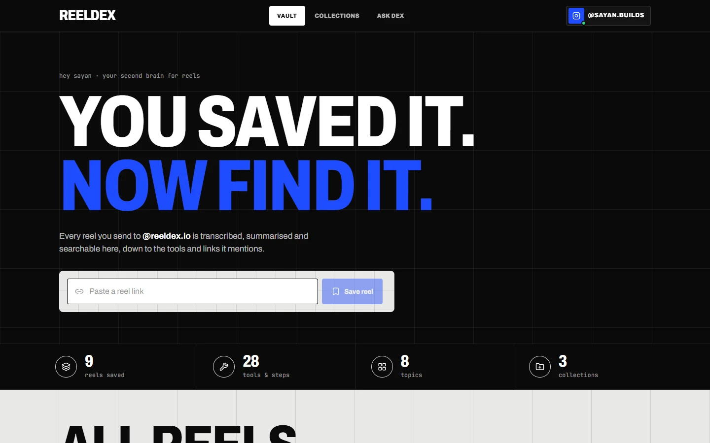
  </a>
</p>

## The problem

Everyone saves reels: a design tool, a recipe, an interview tip, a workout. Instagram's saved tab is a wall of thumbnails with no search, and you can't search what was *said* in a video. So finding "that free AI tool someone mentioned two months ago" means rewatching ten reels. Most of what we save never gets used.

## How ReelDex fixes it

1. **Share any reel to `@reeldex.io` in an Instagram DM**, or paste the link on the web.
2. **ReelDex pulls only the audio** and transcribes every spoken word with timestamps.
3. **AI pulls out what matters:** a title, a summary, key points, the tools and links mentioned, promo codes, and step-by-step instructions. Then it files the reel under a topic. The creator's caption is used too: it fixes misheard names, and for music-only reels with text on screen it's often where the content is.
4. **The bot replies in your DM** with the summary and a link to the reel in your vault.
5. **Search everything, or just ask:** *"What AI design tools have I saved?"* returns an answer that cites the exact reels it came from.

## Features

### Your vault

Every saved reel in one place, with search across titles, creators, tools, and anything said in the video. Filter by topic, switch between a card grid and a table with a category sidebar, and watch new reels go from *fetching* to *transcribing* to *done* live.

<p align="center">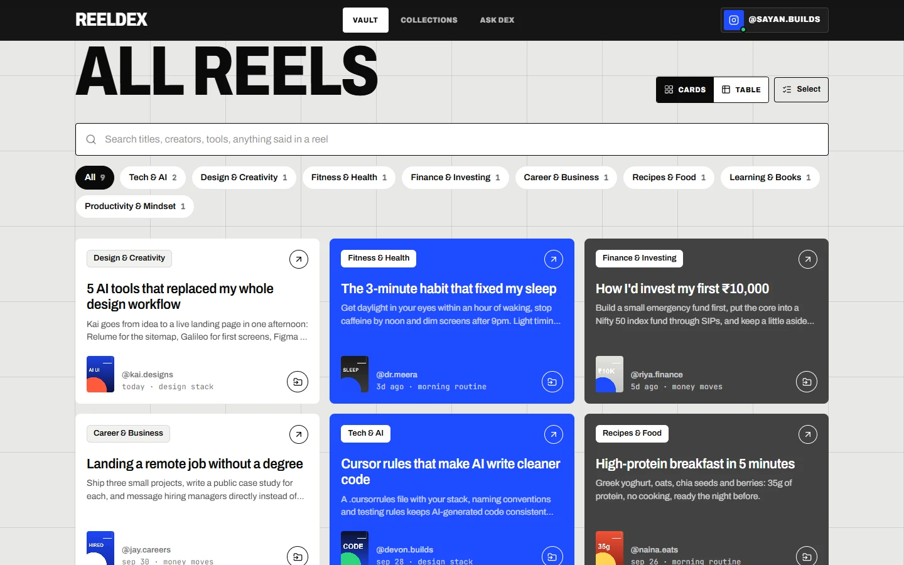</p>

<table>
  <tr>
    <td width="50%">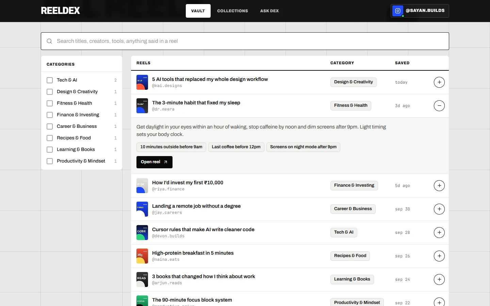</td>
    <td width="50%">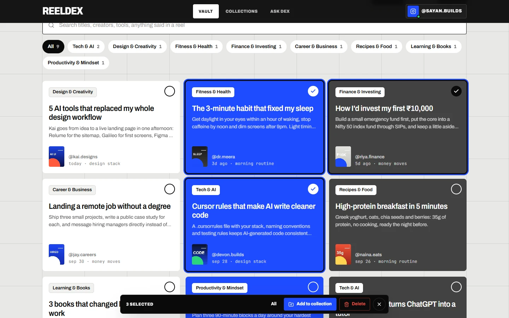</td>
  </tr>
  <tr>
    <td align="center"><sub>Table view: category checkboxes and expandable rows</sub></td>
    <td align="center"><sub>Select mode: bulk add to a collection or delete</sub></td>
  </tr>
</table>

### Everything a reel said, on one page

Each reel has its own page:
- the summary, numbered key points, tools and links, and steps
- the full transcript with timestamps
- the creator's caption
- one-click translation to English for reels in other languages
- downloads as subtitles (`.srt`, with real timings) or `.txt`, or copy the transcript
- a button that opens the reel in the Instagram app on phones
- retry for reels that failed to process

<p align="center">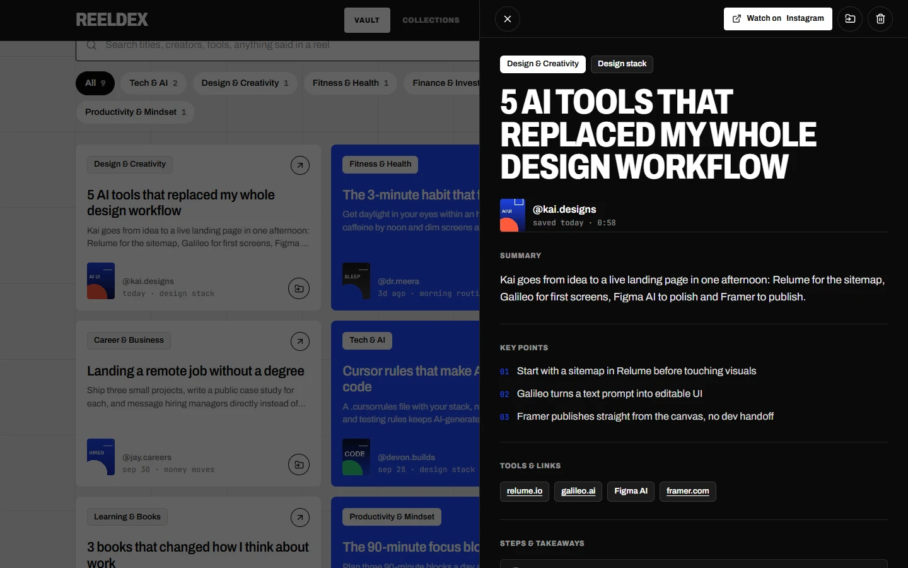</p>

### Ask Dex: chat with your saved reels

Ask questions across your whole library in plain English.

- **Grounded answers:** every answer is built only from your own reels and links back to the videos and creators it used.
- **Show more results:** keeps digging past the first answer.
- **Export:** copy an answer formatted for WhatsApp, copy it as Markdown, or download a `.md` file.
- **Saved chats:** conversations save to your account, add new answers automatically, and can be reopened from any device.

<table>
  <tr>
    <td width="50%">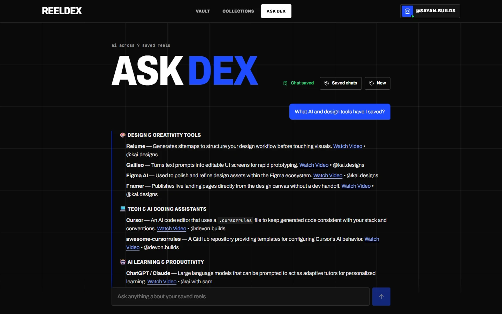</td>
    <td width="50%">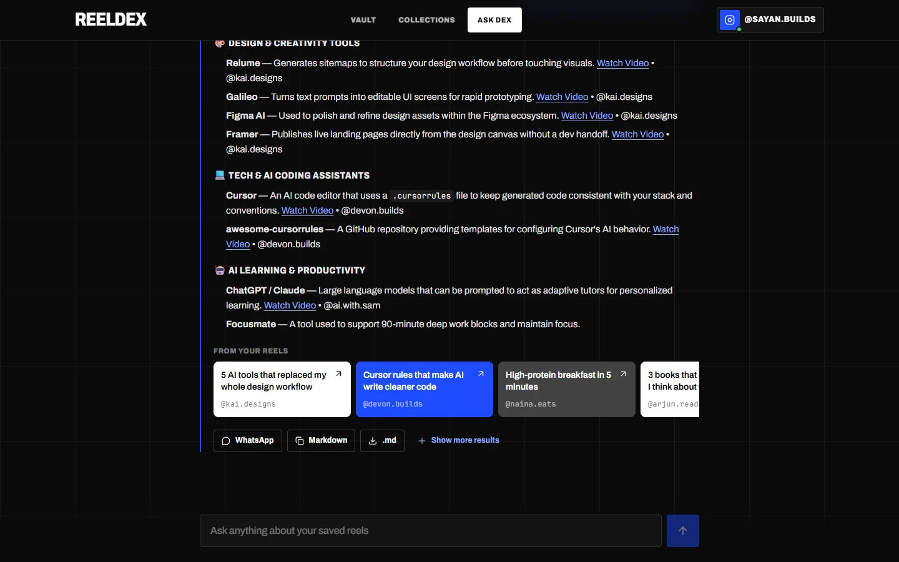</td>
  </tr>
  <tr>
    <td align="center"><sub>Answers grouped by topic, each item linked to its reel</sub></td>
    <td align="center"><sub>Source reels, WhatsApp / Markdown export, show more</sub></td>
  </tr>
</table>

### Collections

Group reels into collections such as *Design stack*, *Morning routine* or *Money moves*. Each one gets a cover made from its first four thumbnails. You can fill a collection from your saved reels, rename it, or move single reels in and out.

<p align="center">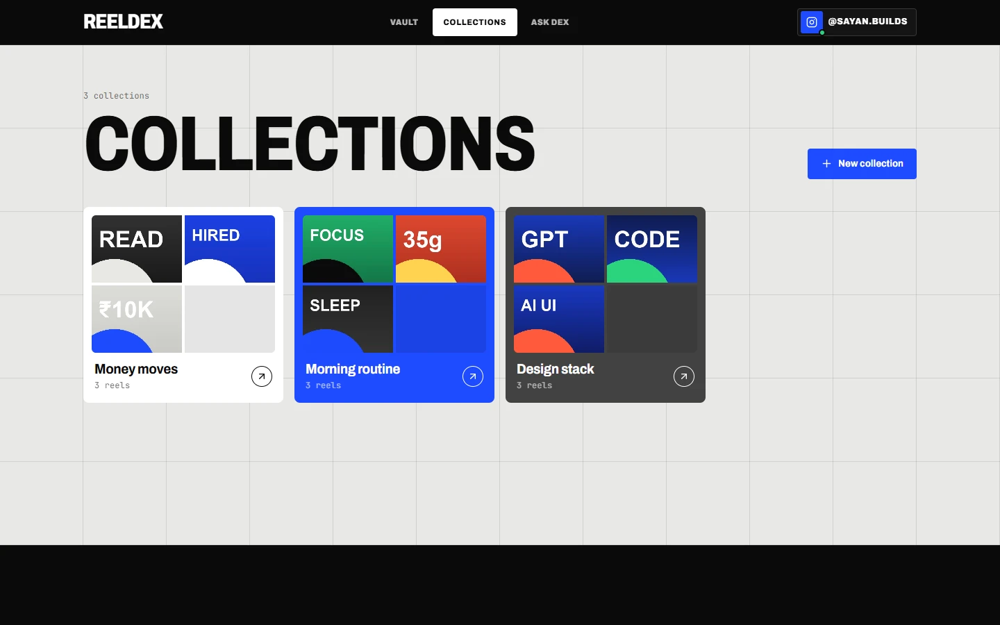</p>

### Made for phones

Most reels are saved on a phone, so the app is built mobile-first. It has a bottom tab bar, full-screen reel pages and a thumb-friendly chat box.

<p align="center">
  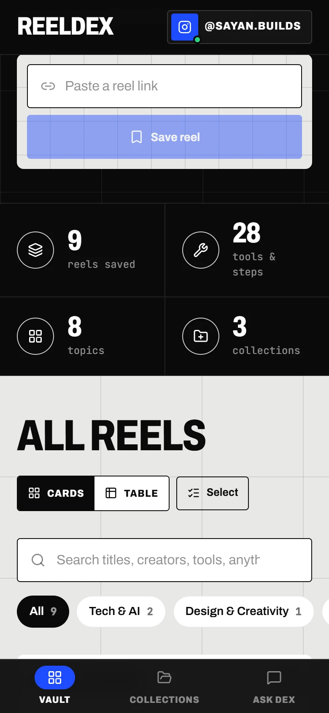
  &nbsp;
  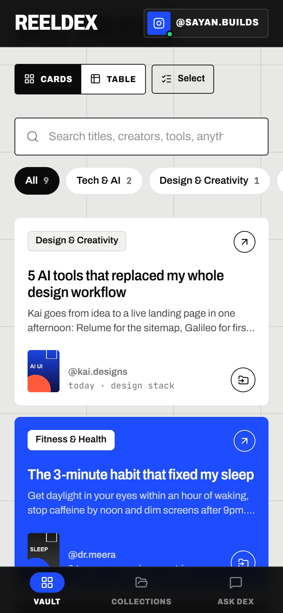
  &nbsp;
  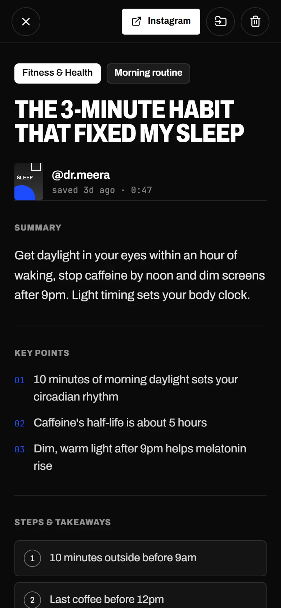
  &nbsp;
  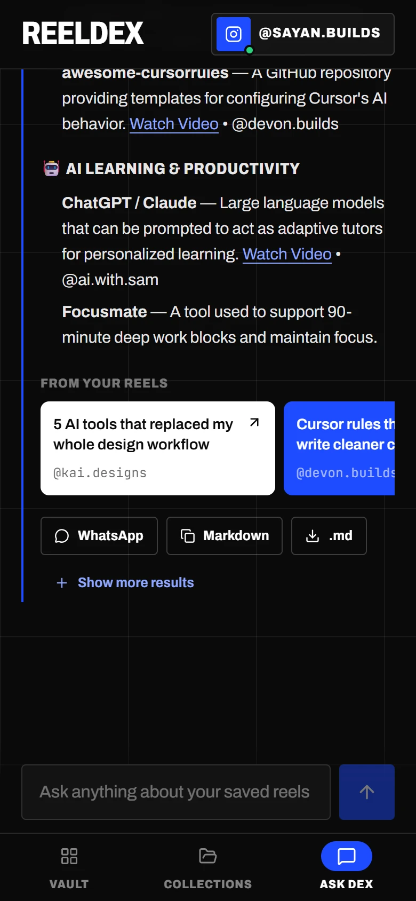
</p>

### Instagram, no password

Link your Instagram by sending a one-time code (`MIND-123456`) to `@reeldex.io` in a DM. The DM bot sends a magic link that signs you straight in. The token is removed from the address bar as soon as it's read.

## Security and reliability

ReelDex handles other people's Instagram accounts and libraries, so access control is enforced on the server for every request:

- **Ownership checks on every endpoint.** Reels, collections and saved chats are scoped to the signed-in user. Guessing another reel's ID returns 404.
- **Signed webhooks.** Instagram webhook calls must carry a valid Meta `X-Hub-Signature-256` HMAC, compared in constant time. The verify handshake uses a constant-time compare too.
- **Exact-match pairing.** A pairing code links an account only if it matches exactly and hasn't expired. Codes last 20 minutes and are single use.
- **Bearer-token auth.** Tokens travel in the `Authorization` header, never in URLs. Normal requests can't create accounts.
- **Per-IP rate limits** on sign-in, pairing, saving reels and AI endpoints. Over the limit, the API returns 429 with `Retry-After`.
- **Input limits.** Requests are validated against size limits. Thumbnail requests only accept real Instagram shortcodes and only fetch HTTPS images, capped at 5 MB.
- **Locked-down server config.** API keys can't be changed over HTTP, and the status endpoint reports only true/false flags.
- **Model fallbacks.** Transcription, insights and Ask Dex each try a chain of models, so one busy or retired model doesn't take the feature down.

## Performance

- **Pay once per viral reel.** If a reel was already transcribed for anyone, its transcript and insights are reused instantly with no AI calls. A lock stops two workers from processing the same reel at the same time.
- **Audio only.** `yt-dlp` pulls just the audio stream, never the full video.
- **Lean list responses.** The library list leaves out full transcripts, and collections and chat load their data in a single query instead of one per reel.
- **Non-blocking AI.** AI calls run on worker threads, so a slow model never stalls other requests.
- **Instant, quiet UI:**
  - the cached library renders immediately
  - polling every 3.5s while a reel processes and every 15s otherwise, paused in background tabs
  - no re-render when nothing has changed
  - lazy-loaded thumbnails
  - the Markdown renderer only loads when Ask Dex opens

## Architecture

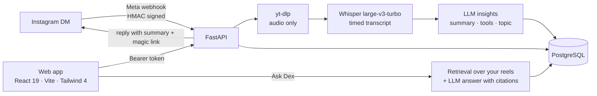
```mermaid
flowchart LR
    IG[Instagram DM] -->|Meta webhook<br/>HMAC signed| API
    W[Web app<br/>React 19 · Vite · Tailwind 4] -->|Bearer token| API[FastAPI]
    API --> DL[yt-dlp<br/>audio only]
    DL --> STT[Whisper large-v3-turbo<br/>timed transcript]
    STT --> LLM[LLM insights<br/>summary · tools · topic]
    LLM --> DB[(PostgreSQL)]
    API --> DB
    API -->|reply with summary + magic link| IG
    W -->|Ask Dex| RAG[Retrieval over your reels<br/>+ LLM answer with citations]
    RAG --> DB
```

| Layer | Technology |
|---|---|
| Web | React 19, Vite, Tailwind CSS 4, lucide icons, sonner, react-markdown |
| API | FastAPI, Uvicorn, SQLAlchemy, Pydantic v2 |
| Speech to text | Whisper large-v3-turbo on Groq, with OpenAI Whisper as a fallback |
| Insights & Ask Dex | Open-weight LLMs on Groq (GPT-OSS 120B/20B, Qwen) with a fallback chain |
| Media | yt-dlp, FFmpeg |
| Data | PostgreSQL in production, SQLite locally, with automatic column migrations |
| Messaging | Instagram Graph API webhooks and DMs |
| Hosting | Vercel (web), Render with Docker (API) |

## Running locally

**Prerequisites:** Python 3.10+, Node.js 18+, FFmpeg, and a [Groq](https://console.groq.com) API key.

```bash
git clone https://github.com/imsayanpaul/Reeldex.git
cd Reeldex
```

**1. API.** Create a `.env` in the repo root:

```env
GROQ_API_KEY=your_groq_key
# Optional: only needed for the Instagram DM bot
INSTAGRAM_PAGE_ACCESS_TOKEN=your_instagram_token
META_VERIFY_TOKEN=any_random_string
META_APP_SECRET=your_meta_app_secret
```

```bash
python -m venv venv
venv\Scripts\activate          # macOS/Linux: source venv/bin/activate
pip install -r requirements.txt
uvicorn backend.main:app --reload --port 8000
```

**2. Web app**

```bash
cd frontend
npm install
VITE_API_URL=http://localhost:8000 npm run dev
```

On Windows PowerShell, run `$env:VITE_API_URL="http://localhost:8000"; npm run dev` instead. Then open http://localhost:5173 and paste a reel link to try it.

## Project structure

```
Reeldex/
├── backend/
│   ├── main.py            # App setup, CORS, startup migrations
│   ├── routes.py          # Reels, collections, Ask Dex, saved chats, webhook
│   ├── auth.py            # Bearer auth, ownership scoping, webhook signatures, rate limits
│   ├── models.py          # Users, reels, transcripts, collections, saved chats
│   ├── downloader.py      # yt-dlp audio extraction
│   ├── transcriber.py     # Whisper transcription with fallback
│   ├── summarizer.py      # Insights and topic classification
│   ├── search.py          # Ranking and Ask Dex retrieval
│   └── instagram_bot.py   # Webhook parsing and DM replies
├── frontend/src/
│   ├── components/        # Vault, reel cards & table, reel detail, collections, Ask Dex, dialogs
│   └── lib/               # API client, session, vault state hook, formatting & exports
├── Dockerfile
└── render.yaml
```

## License

MIT
